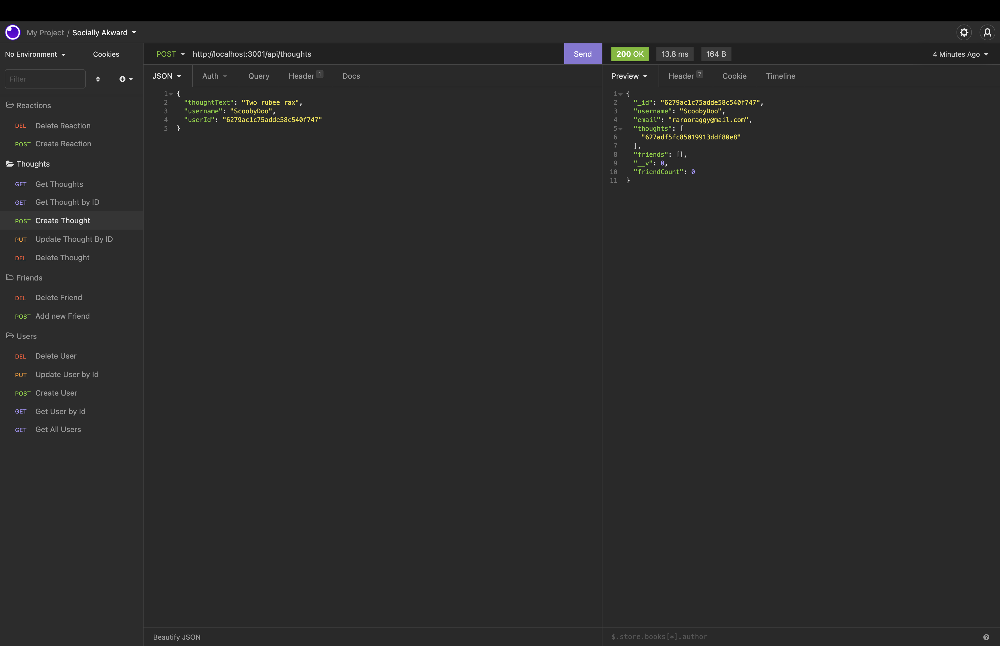
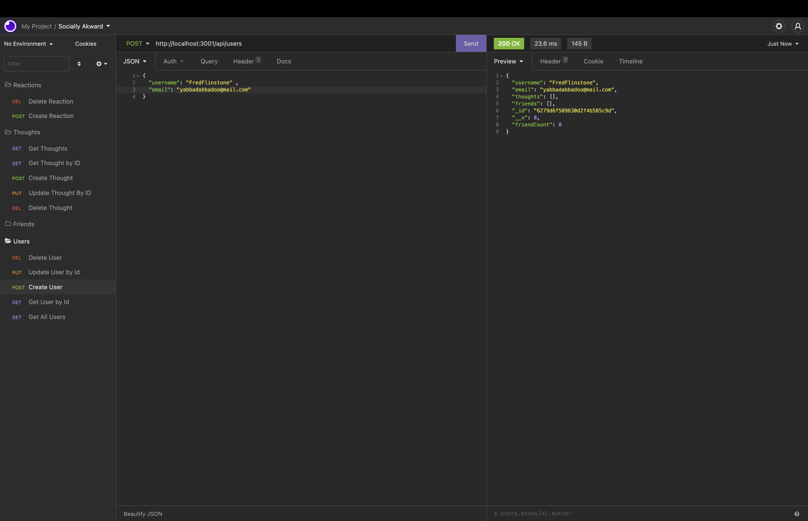

# Socially-akward

# User Story
AS A social media startup
I WANT an API for my social network that uses a NoSQL database
SO THAT my website can handle large amounts of unstructured data

# Acceptance Criteria
- GIVEN a social network API
- WHEN I enter the command to invoke the application
- THEN my server is started and the Mongoose models are synced to the MongoDB database
- WHEN I open API GET routes in Insomnia for users and thoughts
- THEN the data for each of these routes is displayed in a formatted JSON
- WHEN I test API POST, PUT, and DELETE routes in Insomnia
- THEN I am able to successfully create, update, and delete users and thoughts in my database
- WHEN I test API POST and DELETE routes in Insomnia
- THEN I am able to successfully create and delete reactions to thoughts and add and remove friends to a user’s friend list

# Struggles Encountered

Took me a long time to get everything working the way I wanted it too. Several misspelled words ruined the etire application. I went through each route one by one untill I found where the mistakes were. Also for mongodb on MacOS the mongourl had to start with 127.0.0.1:27017 I learned that the hard way.

# Usage
- Clone the Github repo
- In the coding application open terminal and install Express and Mongoose using npm i
- You should have MongoDB already installed in order for it to work
- In the terminal run npm start and have fun

# Video Links
Video Link 1:https://drive.google.com/file/d/1bCP9fWYGM3CD207sFl-pYcXxPSd2RfqC/view

Video Link 2:https://drive.google.com/file/d/1o8ErzTfc7j8VZKJL8AhT6K2DPIIFCUSO/view

# Screenshots

# Made With
- Node.js 
- Express
- MongoDB
- Javascript
